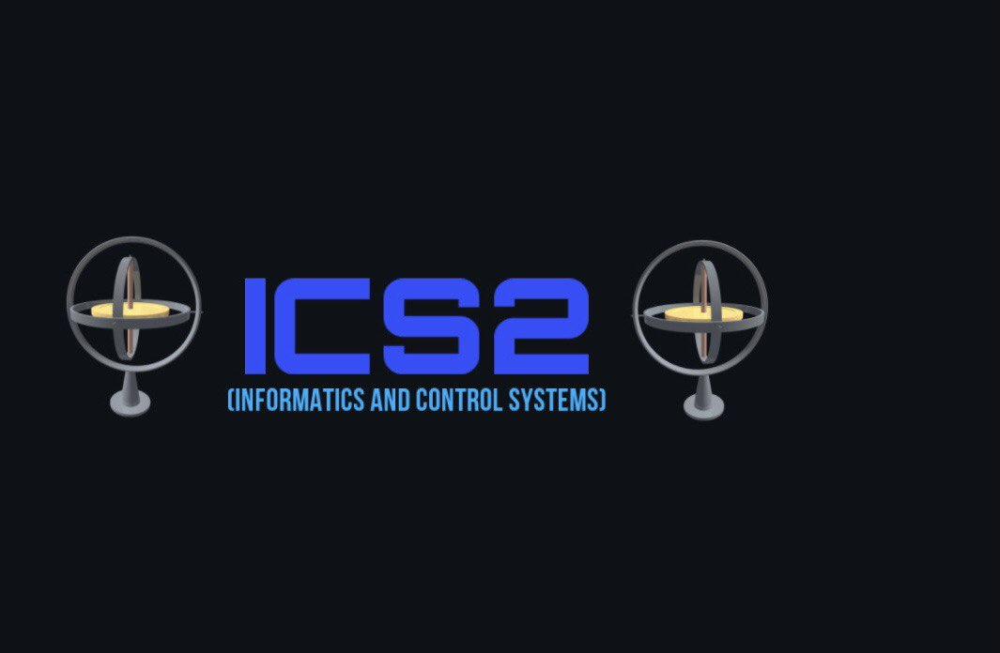

# :computer: Учебные материалы ИУ2 (Приборы и системы ориентации, стабилизации и навигации)

# :open_file_folder: Полезные ссылки
ссылка на сайт кафедры:
[сайт кафедры](http://iu2.bmstu.ru/)

большинство лаб по инфе за 2 сем можно найти тут:
[лабы на паскале](https://github.com/ond-first)

учебный план на весь период обучения тут:
[учебный план](https://github.com/muslimitsuhide/ics2_bmstu/blob/main/%D1%83%D1%87%D0%B5%D0%B1%D0%BD%D1%8B%D0%B9_%D0%BF%D0%BB%D0%B0%D0%BD.pdf)
